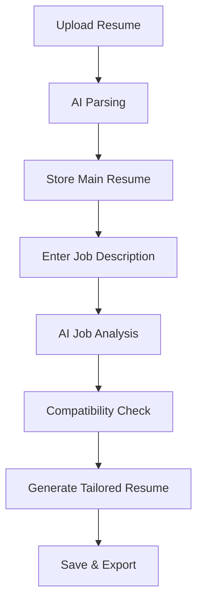

# Jobjigsaw Developer Onboarding Guide

## 🚀 Quick Start

Jobjigsaw is an AI-powered job application and resume customization platform
that helps users tailor their resumes for specific job opportunities. The
platform analyzes job descriptions, matches them with user skills, and generates
optimized resumes using advanced AI models.

## 📋 Prerequisites

Before you begin, ensure you have:

- **Node.js** (v18+) and **npm**
- **Docker** (for local development)
- **Cloudflare CLI** (`wrangler`) for deployment
- **API Keys** (see Environment Setup section)

## 🏗️ Project Architecture

### Overview

```
┌─────────────────┐    ┌─────────────────┐    ┌─────────────────┐
│   Next.js       │    │  Cloudflare     │    │   AI Services   │
│   Frontend      │────│   Workers       │────│  OpenAI/Gemini  │
│                 │    │   Backend       │    │                 │
└─────────────────┘    └─────────────────┘    └─────────────────┘
                                │
                       ┌─────────────────┐
                       │  Cloudflare D1  │
                       │   Database      │
                       └─────────────────┘
```

### Technology Stack

**Backend** (`/backend/`)

- **Runtime**: Cloudflare Workers
- **Framework**: Hono.js for HTTP routing
- **Database**: Cloudflare D1 (SQLite)
- **Storage**: Cloudflare R2 for file uploads
- **AI**: OpenAI GPT-4, Google Gemini via Cloudflare AI Gateway
- **Web Scraping**: Puppeteer, Jina AI

**Frontend** (`/jobjigsaw-frontend/`)

- **Framework**: Next.js 15 with App Router
- **Language**: TypeScript
- **Styling**: Tailwind CSS v4
- **UI Components**: Custom components with Heroicons
- **Deployment**: Cloudflare Pages via OpenNext

**Legacy Frontend** (`/frontend/`)

- **Framework**: React + Vite
- **Status**: Read-only legacy project, not actively developed. All new work is done in `/jobjigsaw-frontend/`

## 🚦 Getting Started

### 1. Clone and Setup

```bash
git clone <repository-url>
cd Jobjigsaw

# Install backend dependencies
cd backend
npm install

# Install frontend dependencies  
cd ../jobjigsaw-frontend
npm install
```

### 2. Environment Setup

#### Backend Environment (`/backend/.env`)

```env
# Required API Keys
OPENAI_API_KEY=sk-...                    # OpenAI API key
SERP_API_KEY=...                         # SERP API for web search
OPENROUTER_API_KEY=...                   # Alternative AI models

# Cloudflare Configuration
CLOUDFLARE_ACCOUNT_ID=...
CLOUDFLARE_API_TOKEN=...
```

#### Frontend Environment (`/jobjigsaw-frontend/.env.local`)

```env
NEXT_PUBLIC_API_BASE_URL=http://localhost:8787  # Backend URL
```

### 3. Running the Application

#### Development Mode

**Note**: Developers will run `npm run dev` commands manually. Any AI Agents should not run it themselves unless developer explicitly asks the agent to run them.

```bash
# Terminal 1: Start backend
cd backend
npm run dev

# Terminal 2: Start frontend
cd jobjigsaw-frontend  
npm run dev
```

#### Production Build

```bash
# Backend deployment
cd backend
npm run deploy

# Frontend deployment
cd jobjigsaw-frontend
npm run deploy
```

## 🏛️ Code Architecture

### Backend Structure (`/backend/src/`)

#### Core Components

- **`index.ts`**: Main application entry point with HTTP routes
- **`database.ts`**: D1 database connection and initialization
- **`openai.ts`**: AI service integrations (OpenAI/Gemini)
- **`jina.ts`**: Web scraping and search services

#### Service Layer Pattern

```
┌─────────────────┐
│   Controllers   │  ← HTTP route handlers (index.ts)
│   (Routes)      │
└─────────────────┘
         │
┌─────────────────┐
│    Services     │  ← Business logic layer
│  (Job, Resume,  │
│   MainResume)   │
└─────────────────┘
         │
┌─────────────────┐
│     Models      │  ← Data access layer
│  (Database)     │
└─────────────────┘
```

#### Service Classes

**JobService** (`/backend/src/job/jobService.ts`)

- Manages job postings and analysis
- Key methods: `createJob()`, `getJobs()`, `getJobById()`

**MainResumeService** (`/backend/src/mainResume/mainResumeService.ts`)

- Singleton pattern for user's primary resume
- Key methods: `setMainResume()`, `getMainResume()`, `updateMainResume()`

**ResumeService** (`/backend/src/resume/resumeService.ts`)

- Manages job-specific customized resumes
- Key methods: `createResume()`, `getResumes()`, `generateResume()`

### Frontend Structure (`/jobjigsaw-frontend/src/`)

#### App Router Structure

```
/app/
├── page.tsx                 # Home - Job analysis interface
├── main-resume/page.tsx     # Resume upload and management
├── create-job/page.tsx      # Job creation interface
├── saved-jobs/page.tsx      # Job history (placeholder)
├── saved-resumes/page.tsx   # Resume library (placeholder)
└── api/                     # API routes (proxy to backend)
    ├── job/
    ├── main-resume/
    └── resume/
```

#### Key Components

- **`JobInferencer`** (`/components/JobInferencer.tsx`): Main job analysis
  interface
- **`NavLinks`** (`/components/NavLinks.tsx`): Application navigation

## 🔄 User Journeys & Data Flow

### Primary Workflow



### 1. Resume Upload Flow

**User Action**: Upload PDF/JSON resume

**Frontend**: `/main-resume/page.tsx`

```tsx
const handleUploadResume = async (file: File) => {
    const formData = new FormData();
    formData.append("resume", file);
    await uploadResume(formData); // API call
};
```

**API**: `POST /api/main-resume/uploadResume` **Backend**: `POST /main-resume` →
`MainResumeService.updateMainResume()` **AI Processing**:
`generateJsonFromResume()` parses resume using OpenAI

### 2. Job Analysis Flow

**User Action**: Enter job description or URL

**Frontend**: `JobInferencer` component

```tsx
const handleInferJob = async () => {
    const result = await inferJob(jobDescription);
    setInferredJob(result.inferredDescription);
};
```

**API**: `POST /api/job/infer` **Backend**: `POST /job/infer` →
`inferJobDescription()` **AI Processing**: Extracts structured job data (title,
skills, requirements)

### 3. Compatibility Analysis

**API**: `POST /api/job/infer-match` **Backend**: `checkCompatiblity()` compares
resume vs job requirements **Output**: Match percentage, skill gaps,
recommendations

### 4. Resume Generation

**API**: `POST /api/resume/generate`\
**Backend**: `generateResume()` creates tailored resume **AI Processing**:
Optimizes content for specific job requirements

## 🧠 AI Integration

### OpenAI Functions (`/backend/src/openai.ts`)

#### Core AI Operations

1. **`generateJsonFromResume()`**: Parse uploaded resumes
2. **`inferJobDescription()`**: Extract job requirements
3. **`checkCompatiblity()`**: Score job-resume compatibility
4. **`generateResume()`**: Create customized resumes
5. **`inferJobDescriptionFromUrl()`**: Scrape and analyze job URLs

#### AI Prompt Engineering

- **Resume Parsing**: Extracts contact, skills, experience, education
- **Job Analysis**: Identifies technical/soft skills, requirements,
  "sugar-coating"
- **Compatibility**: Provides match scores and improvement suggestions
- **Generation**: Creates factual, tailored content without fabrication

### Model Configuration

- **Primary**: OpenAI GPT-4 via Cloudflare AI Gateway
- **Fallback**: Google Gemini
- **Selection**: Environment variable `useOpenAi` flag

## 🗄️ Database Schema

### Tables Overview

```sql
-- Main user resume (singleton)
CREATE TABLE mainResumes (
    id INTEGER PRIMARY KEY DEFAULT 1,
    resumeName TEXT,
    resumeContent TEXT,          -- JSON structure
    dateCreated TEXT,
    dateUpdated TEXT
);

-- Job postings and analysis
CREATE TABLE jobs (
    id INTEGER PRIMARY KEY,
    companyName TEXT,
    jobTitle TEXT,
    jobDescription TEXT,
    jobUrl TEXT,
    jobStatus TEXT,
    inferredData TEXT,           -- AI analysis results
    jobFitScore INTEGER,
    jobFitBreakdown TEXT,
    -- ... additional fields
);

-- Generated customized resumes
CREATE TABLE resumes (
    id INTEGER PRIMARY KEY,
    resumeName TEXT,
    resumeContent TEXT,          -- Tailored resume JSON
    jobId INTEGER,               -- Links to jobs table
    dateCreated TEXT,
    dateUpdated TEXT
);
```

## 📝 API Reference

### Job Endpoints

```http
POST   /job                     # Create job
GET    /job                     # List all jobs  
GET    /job/:id                 # Get specific job
DELETE /job/:id                 # Delete job
POST   /job/infer               # Analyze job description
POST   /job/infer-url           # Analyze job from URL
POST   /job/infer-match         # Check compatibility
POST   /job/analyze             # Full job analysis
```

### Resume Endpoints

```http
GET    /main-resume             # Get main resume
POST   /main-resume             # Upload/parse resume
PUT    /main-resume             # Update main resume

POST   /resume                  # Create customized resume
GET    /resume                  # List all resumes
GET    /resume/:id              # Get specific resume
PUT    /resume/:id              # Update resume
DELETE /resume/:id              # Delete resume
POST   /resume/generate         # Generate tailored resume
```

## 🧪 Testing

### Backend Tests (`/backend/test/`)

```bash
cd backend
npm test                        # Run Vitest tests
```

### Test Structure

- **`index.spec.ts`**: API endpoint testing
- **Vitest**: Test runner with Cloudflare Workers support
- **Environment**: Test environment configuration

## 🚀 Deployment

### Backend Deployment (Cloudflare Workers)

```bash
cd backend
npm run deploy                  # Deploy to Cloudflare Workers
```

### Frontend Deployment (Cloudflare Pages)

```bash
cd jobjigsaw-frontend
npm run deploy                  # Build and deploy via OpenNext
```

### Environment Variables

- **Backend**: Configured in `wrangler.jsonc`
- **Frontend**: Configured in Cloudflare Pages dashboard

## 🔧 Development Workflow

### 1. Feature Development

1. **Backend First**: Implement API endpoints and business logic
2. **Frontend Integration**: Create UI components and API integration
3. **Testing**: Add tests for new functionality
4. **Documentation**: Update relevant documentation

### 2. Code Standards

- **TypeScript**: Strict type checking enabled
- **ESLint**: Code quality enforcement
- **Prettier**: Code formatting (backend only)
- **Conventional Commits**: Use emoji-prefixed commit messages

### 3. Git Workflow

```bash
# Feature development
git checkout -b feature/new-feature
git commit -m "✨ feat: Add new feature"

# Bug fixes  
git commit -m "🐛 fix: Resolve issue with X"

# Documentation
git commit -m "📝 docs: Update onboarding guide"
```

## 🔍 Key Files Reference

### Backend Core Files

- [`/backend/src/index.ts`](/backend/src/index.ts) - Main application routes
- [`/backend/src/openai.ts`](/backend/src/openai.ts) - AI service integration
- [`/backend/src/database.ts`](/backend/src/database.ts) - Database
  configuration
- [`/backend/src/job/jobService.ts`](/backend/src/job/jobService.ts) - Job
  business logic
- [`/backend/src/mainResume/mainResumeService.ts`](/backend/src/mainResume/mainResumeService.ts) -
  Resume management
- [`/backend/wrangler.jsonc`](/backend/wrangler.jsonc) - Cloudflare Workers
  config

### Frontend Core Files

- [`/jobjigsaw-frontend/src/app/page.tsx`](/jobjigsaw-frontend/src/app/page.tsx) -
  Home page
- [`/jobjigsaw-frontend/src/components/JobInferencer.tsx`](/jobjigsaw-frontend/src/components/JobInferencer.tsx) -
  Main interface
- [`/jobjigsaw-frontend/src/app/main-resume/page.tsx`](/jobjigsaw-frontend/src/app/main-resume/page.tsx) -
  Resume management
- [`/jobjigsaw-frontend/next.config.ts`](/jobjigsaw-frontend/next.config.ts) -
  Next.js configuration
- [`/jobjigsaw-frontend/package.json`](/jobjigsaw-frontend/package.json) -
  Dependencies and scripts

## ⚠️ Known Issues & Limitations

### Current Limitations

1. **Single User System**: No authentication or multi-tenancy
2. **Incomplete UI**: Saved Jobs and Saved Resumes pages are placeholders
3. **No Global State**: Limited state management between components
4. **Error Boundaries**: Basic error handling implementation

### Areas for Improvement

1. **Authentication**: Implement user accounts and authentication
2. **State Management**: Add Redux or Zustand for global state
3. **UI Completion**: Build out missing list and detail views
4. **Testing Coverage**: Expand test coverage for frontend components
5. **Performance**: Add caching and optimization strategies

## 🤝 Contributing

### Development Setup

1. Follow the Getting Started section
2. Create feature branches for new work
3. Write tests for new functionality
4. Update documentation as needed
5. Submit pull requests with clear descriptions

### Code Review Guidelines

- **Functionality**: Ensure features work as expected
- **Performance**: Consider impact on load times and AI costs
- **Security**: Review for potential security vulnerabilities
- **Documentation**: Verify documentation updates are included

## 📚 Additional Resources

- [Cloudflare Workers Documentation](https://developers.cloudflare.com/workers/)
- [Hono.js Documentation](https://hono.dev/)
- [Next.js App Router Guide](https://nextjs.org/docs/app)
- [OpenAI API Documentation](https://platform.openai.com/docs)
- [Tailwind CSS Documentation](https://tailwindcss.com/docs)

---

**Welcome to the Jobjigsaw project!** This onboarding guide provides everything
you need to understand, develop, and contribute to the codebase. For questions
or clarifications, refer to the code files linked throughout this document.
