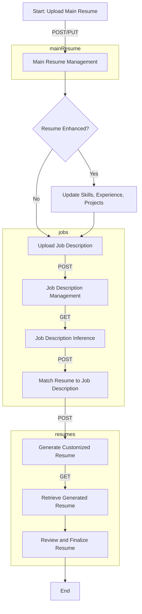

# Jobjigsaw

One Paragraph of project description goes here. Explain the main goal of the project and what problem it solves.

## Getting Started

These instructions will get you a copy of the project up and running on your local machine for development and testing purposes.

### Prerequisites

What things you need to install the software and how to install them.

```
Give examples
```

### Installing

A step by step series of examples that tell you how to get a development environment running.

Say what the step will be

```
Give the example
```

And repeat

```
until the finished
```

End with an example of getting some data out of the system or using it for a little demo.

## Running the tests

Explain how to run the automated tests for this system.

### Break down into end to end tests

Explain what these tests test and why

```
Give an example
```

### And coding style tests

Explain what these tests test and why

```
Give an example
```

## Deployment

Add additional notes about how to deploy this on a live system.

## Built With

* [YourTechStack] - The web framework used
* [YourDatabase] - Dependency Management
* [YourTool] - Used to generate RSS Feeds



## Contributing

Please read [CONTRIBUTING.md](http://example.com/) for details on our code of conduct, and the process for submitting pull requests to us.

## Versioning

We use [SemVer](http://semver.org/) for versioning. For the versions available, see the [tags on this repository](http://example.com/).

## Authors

* **Your Name** - *Initial work* - [YourProfile](http://example.com/)

See also the list of [contributors](http://example.com/) who participated in this project.

## License

This project is licensed under the [Your License] License - see the [LICENSE.md](LICENSE.md) file for details

## Acknowledgments

* Hat tip to anyone whose code was used
* Inspiration
* etc
