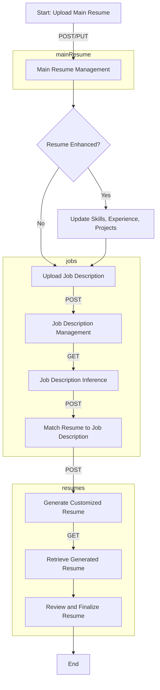

# Jobjigsaw

## About

Jobjigsaw is a comprehensive project designed to streamline the job application and resume creation process. It is divided into two main components: a backend system that handles data management, job postings, and resume generation, and a frontend application that provides a user-friendly interface for job seekers and employers. The project leverages modern technologies and frameworks to ensure a seamless experience for users.

## Installation and Usage

### Prerequisites

Before you can run Jobjigsaw, you need to have Docker installed on your machine as the project utilizes Docker containers for both the backend and frontend services. This service also uses following keys, make sure you have them all.

- OpenAI API Key (`OPENAI_API_KEY`): To infer Jobdescription and provide a customized resume. [OpenAI API Keys page](https://platform.openai.com/api-keys)
- SERP API Key (`SERP_API_KEY`): To search the internet and find out about the company. [Serp API Dashboard link](https://serpapi.com/dashboard)
- OpenRouter API Key (`OPENROUTER_API_KEY`): If you want to use other models apart from GPTs, you can use openrouter. [OpenRouter API Homepage](https://openrouter.ai/)

### Getting Started

1. Clone the repository to your local machine.
2. Navigate to the project directory.

For the backend service:

3. Go to the `backend` directory.
4. Copy the `.env.reference` file to `.env` and adjust the environment variables according to your setup.
5. Build and run the Docker container using the Dockerfile provided.

For the frontend service:

6. Navigate to the `jobjigsaw-frontend` directory.
7. Install the dependencies using `npm install`.
8. Start the development server using `npm start`.

### Accessing the Application

- The frontend application will be accessible at `http://localhost:3000` by default.
- The backend services will be accessible on the port specified in your `.env` configuration.

## About the Code

The Jobjigsaw project is structured into several key directories and files, each serving a specific purpose:

- `.devcontainer` and `.dockerignore`: Configuration files for Docker and development containers.
- `.github/workflows`: Contains GitHub Actions workflows for CI/CD processes.
- `backend`: The backend directory houses all the server-side code, including database management (`database.ts`, `database.db`), API routes (`routes.ts`), and business logic for jobs and resumes. It also contains Docker configurations for deployment. Read more about the code and workflow [here](./backend/codeInferrence.md).
- `jobjigsaw-frontend`: This directory contains all frontend-related files, including React components (`src`), styling (`index.css`, `tailwind.config.js`), and configuration files for TypeScript and Vite. Read more about the code and workflow [here](./jobjigsaw-frontend/codeInferrence.md).

The project makes use of TypeScript for both backend and frontend development, ensuring type safety and enhancing code quality. Docker is used to containerize the services, making the application easy to deploy and scale.

Document Generated with Thanks to [SourceSailor-CLI](https://www.npmjs.com/package/sourcesailor). [SourceSailor Github](https://github.com/PrashamTrivedi/SourceSailor-CLI)